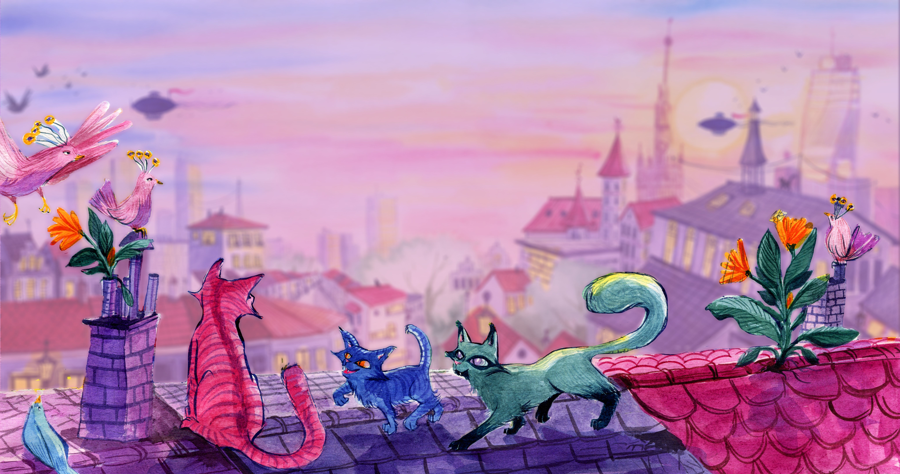
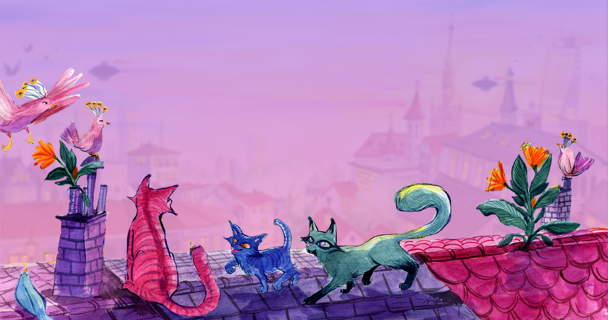

# Catts (Calmer Alt-Tab Task Switcher)

__Catts is a calmer <kbd>alt</kbd> + <kbd>tab</kbd> task switcher for [elementary OS 6 (Odin)](https://elementary.io).__

For elementary OS versions 5.x, please use [Gala Alt Tab Plus](https://github.com/markstory/gala-alt-tab-plus).


[Want the wallpaper?](#get-the-wallpaper)

## Version details

  - __1.0.1 (2021-08-29)__ Pressing escape now properly cancels the task switch without changing the focussed window. ([Fix](https://github.com/elementary/gala/pull/1234/commits/acc986598d456857df1f5f8db4d57c1d0ef1176c) by [David M. Hewitt](https://github.com/davidmhewitt).)

  - __1.0.0 (2021-08-28)__ Initial release.

For full notes, please [see the change log](./CHANGELOG.md).

_To upgrade, please follow the installation instructions, below, to reinstall the latest binary._

## Install

> _The following instructions download and install the Catts shared library binary. If you want to build it yourself instead, please see the [for developers](#for-developers) section._

__Open up a Terminal session (press <kbd>⌘</kbd> + <kbd>T</kbd>) and copy and paste the following commands to install Catts on your system.__

Please use the copy/clipboard button that appears when you hover over a code snippet to ensure that you copy the whole command instead of just a portion of it by mistake.

1.  __Download Catts__ shared library binary ([libgala-catts.so](https://small-tech.org/downloads/catts/1.0.0/libgala-catts.so)) from [small-tech.org](https://small-tech.org) to the temporary directory on your computer (_/tmp_):

    ```shell
    wget https://small-tech.org/downloads/catts/1.0.1/libgala-catts.so -O /tmp/libgala-catts.so
    ```

2. __Verify the downloaded file__ is what you expect:

    ```shell
    bash -lic "test \"\$(sha256sum /tmp/libgala-catts.so)\" = '7ab574482f93d2b4881788631893a540bae2f64838d82cfcbadb9d8c74c11922  /tmp/libgala-catts.so' && echo 'Download OK.' || echo '🛑 STOP. Security error. File has been tampered with. DO NOT PROCEED.'"
    ```

    __Unless you see `Download OK`, do NOT proceed to Step 3.__ (Instead, [open an issue here](https://github.com/small-tech/catts/issues) and let us know what happened.)

3. __Install the downloaded file__ as a [Gala](https://github.com/elementary/gala) plugin:

    (Terminal will warn you that you are trying to paste a command that requires administrative privileges. When you press return to execute it, the command will prompt you to allow it administrative privileges by entering your system password.)

    ```shell
    sudo mv /tmp/libgala-catts.so /usr/lib/x86_64-linux-gnu/gala/plugins/; sudo chown root:root /usr/lib/x86_64-linux-gnu/gala/plugins/libgala-catts.so
    ```

4. __Reboot.__

    If you don’t want to restart your computer, you can also start using Catts right away by issuing the following command:

    ```shell
    gala --replace &
    ```

    But it’s cleaner if you reboot. And less to type too:

    ```shell
    reboot
    ```

You can now <kbd>Alt</kbd> + <kbd>Tab</kbd> in peace.


### If Alt + Shift + Tab doesn't work…

Elementary ships with <kbd>Alt</kbd> + <kbd>Shift</kbd> bound to switch keyboard layout. Go to _Settings_ → _Keyboard_ → _Layout_ and either set _Switch layout_ to _Disabled_ (if you don’t have multiple keyboard layouts) or to a different key combination. Elementary should really ship with this setting set to _Disabled_ by default.

## Why Catts?

A quick visual demonstration should suffice (if it doesn’t, please read on for the various reasons outlined below.)

### Elementary OS stock task switcher:


### Catts:


In other words, because:

  - <kbd>alt</kbd> + <kbd>tab</kbd> is a hidden, shortcut gesture for quickly switching between the various windows you have open.

  - There is already a graphically-heavy, slower alternative with the “Show Desktop” (<kbd>⌘</kbd> + <kbd>↓</kbd>) gesture that gives you an overview of the windows within a workspace with window previews that can be used if differentiating windows based on their contents is important.

__In elementary OS, however, the task switcher:__

  - __Overloads the dock__ (the dock is transformed to include icons of windows and the icons there used to indicate which window you’re switching to). This breaks the physicality of the dock and overloads its meaning. That said, due to the amount of other animation going on, willing myself to concentrate on the dock is the only way I can use it at all.

  - __Has excessive motion__ (animates windows backwards or forwards while dimming them in/out every time you press <kbd>alt</kbd> + <kbd>tab</kbd>). Imagine that happening with maximized or half-screen windows on a 24" monitor. I don’t normally have issues with motion and it makes me feel seasick after a few uses.

  - __Gets stuck.__ Sometimes it will just get stuck in a state where no window is selected. Pressing <kbd>alt</kbd> + <kbd>tab</kbd> again gets you out of it.

  - __Is one-way__ (<kbd>shift</kbd> + <kbd>alt</kbd> + <kbd>tab</kbd>) doesn’t do anything.

Basically, the task switcher in elementary OS is unusable.

This one, despite its [limitations](#limitations), at least fixes the above issues.

__Catts:__

  - __Is calm.__ It does not animate my windows. I don’t want cognitive complexity when I’m fast switching between apps. I want to select the app I want to switch to and switch to it. That’s it.

  - __Uses icons.__ There is very little cognitive load to recognising an icon. There’s a reason we use icons of applications in menus, etc., instead of tiny thumbnails of them. The same principles apply here.

  - __Enables you to tell apart different windows of the same app__ (simply, by displaying the window title in the switcher alongside the icon).

  - __Uses the system colour scheme.__ Love Dark Mode? Catts does too.

I feel elementary OS would be far more usable in general – not to mention more familiar for folks just coming over from macOS or Windows – if we were to [replace the default task switcher with Catts](https://github.com/elementary/gala/issues/1232).

In fact, I’ve opened [a feature request on the elementary OS Gala to do just that](https://github.com/elementary/gala/issues/1232). If you agree, please [give it a thumbs up](https://github.com/elementary/gala/issues/1232) to show your support.

## Limitations

Catts implements the bare minimum functionality for a calm task switching experience and nothing more.

It currently has the following major limitations:

  - [__Drag and drop does not work.__](https://github.com/small-tech/catts/issues/2) You should be able to both (a) continue a drag and drop that you started prior to activating the task switcher (e.g., you want to drag a photo from Photos into the app you’re working in) and (b) you should be able to drag and drop onto the icons which should act as proxies for the apps/windows themselves.

  - [__Only includes apps in the current workspace.__](https://github.com/small-tech/catts/issues/3) You should be able to switch to apps in any workspace.

  - [__Cannot exit app with <kbd>Ctrl</kbd> + <kbd>Q</kbd> while selected.__](https://github.com/small-tech/catts/issues/5) It is a productivity boost to be able to use the task switcher to close and app by quickly selecting its icon and, while continuing to hold down <kbd>Alt</kbd>, pressing <kbd>Ctrl</kbd> + <kbd>Q</kbd> to quit the selected app (especially when you want to quit several apps together). This is currently not supported by Catts. The workaround is to switch to the app first and then press <kbd>Ctrl</kbd> + <kbd>Q</kbd>.

If you’d like to help us implement any of these features, [please say hello on Discussions](https://github.com/small-tech/catts/discussions) and tell us which of these limitations you’d like to help overcome.

## Get the wallpaper

The wallpaper you see in the screenshot was commissioned for Catts from the singular [Margo de Weerdt](https://www.margodeweerdt.com/). And you’re welcome to download and use it in all its 4K glory on your own computer if you like.

There are three versions: The one you see in the header has a very shallow depth of field (what the cool kids call “bokeh”) and a pink-purple gradient filter applied for the sake of keeping the focus on the task switcher. There is also one with less bokeh as well as the original illustration by Margo without any of Aral’s meddling.

All three are released under the [Creative Commons Attribution-NonCommercial-ShareAlike 4.0 International License](https://creativecommons.org/licenses/by-nc-sa/4.0/). Please credit [Margo de Weerdt](https://www.margodeweerdt.com/) and [Catts](https://github.com/small-tech/catts) by [Small Technology Foundation](https://small-tech.org).

### Original


### Shallower depth of field



### Even shallower depth of field (did someone say bokeh?)



## Like this? Fund us!

[Small Technology Foundation](https://small-tech.org) is a tiny, independent not-for-profit.

We exist in part thanks to patronage by people like you. If you share [our vision](https://small-tech.org/about/#small-technology) and want to support our work, please [become a patron or donate to us](https://small-tech.org/fund-us) today and help us continue to exist.

---

## For developers

The following are technical details for developers who want to manually compile or hack on Catts.

### Dependencies

- elementary-sdk
- libclutter-1.0-dev
- libwnck-3-dev

Make sure you `apt install` all of the above requirements before trying to build.

## Build

```bash
mkdir build
cd build
cmake ..
make
sudo make install
```

## Test

Modifying the primary gala instance can result in a broken desktop that requires a restart to fix.

After following the Installation instructions, stop before the ‘Restart Gala’ step and, instead, use [xephyr](https://en.wikipedia.org/wiki/Xephyr) to create a separate session:

```bash
sudo apt install xserver-xephyr

# Running the test script starts up a new session using
# xephyr and launches the Calculator, and Tasks apps.
./test.sh
```

When the xephyr window appears, give it focus by pressing <kbd>ctrl</kbd> + <kbd>shift</kbd> and test out the new alt-tab behaviour.

__Note:__ Don’t have the Calculator or Tasks apps running in your primary session before running the test script as that will lead to the app not launching in your test session.

Once you're done testing you can remove the plugin with.

```bash
./cleanup.sh
```

## Replace Gala

After you’ve built Catts, you can replace the task switcher in your main session by running:

```shell
# Restart Gala
gala --replace &
```

## Like this? Fund us!

[Small Technology Foundation](https://small-tech.org) is a tiny, independent not-for-profit.

We exist in part thanks to patronage by people like you. If you share [our vision](https://small-tech.org/about/#small-technology) and want to support our work, please [become a patron or donate to us](https://small-tech.org/fund-us) today and help us continue to exist.

## Version details, history, and credits

__Catts is only for elementary OS 6 (Odin).__

For elementary OS versions 5.x, please use [Gala Alt Tab Plus](https://github.com/markstory/gala-alt-tab-plus).

Catts is based on [Gala Alt Tab Plus](https://github.com/markstory/gala-alt-tab-plus) by [Mark Story](https://github.com/markstory) which is based on [Gala Window Manager Alternative Window Switcher](https://github.com/tom95/gala-alternate-alt-tab) by [Tom Beckmann](https://github.com/tom95).

## License

Portions copyright ⓒ 2021 [Aral Balkan](https://ar.al), [Small Technology Foundation](https://small-tech.org)

Licensed under [GNU GPL 3.0](./LICENSE)
